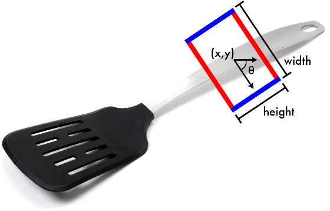

# Detecting grasping positions with deep neural networks using RGB images

_(I will upload the trained model in a few days. You can train better yourself if you have the time and the machine or if you are learning Tensorflow/ML. Please bear in mind that you need to read and adapt to your needs some parts of the code. Feel free to open an issue if you need help.)_

This implementation is mainly based on the algorithm from Redmon and Angelova described in [arXiv:1412.3128v2](https://arxiv.org/abs/1412.3128).

The method uses an RGB image to find a single grasp. A deep convolutional neural network is applied to an image of an ohject and as a result one gets the coordinates, dimensions, and orientation of one possible grasp.

The images used to train the network are from [Cornell Grasping Dataset](http://pr.cs.cornell.edu/grasping/rect_data/data.php).

### Problem description

Having in mind a parallel plate griper before it closes, a simple and natural way of picturing the grasping position in an image would be a rectangle (see figure 1).

One way representing it uniquely is as 

    g = {x, y, \theta, h, w}

where (x,y) is the center of the rectangle, \theta is the orientation of the rectangle to the horizontal axis of the image, _h_ and _w_ are the dimensions (height and width) of the rectangle.

The sole purpose of this small library is to train a network that given a RGB image is able (with some accuracy) to predict a possible grasp _g_.

## How to train from scratch

The procedure follows these steps:

  - convert ImageNet in TFRecord format
  - train the model on ImageNet
  - convert the grasping dataset in TFRecords
  - train on the grasping dataset using the pretrained weights

### Prepering Imagenet

Before running the script you will need to download and convert the ImageNet data to native TFRecord format. Check this [link](https://github.com/tensorflow/models/tree/master/research/inception#getting-started) from the Inception model from Google. I found the whole Inception model in Github very useful.

### Training on Imagenet

Running `imagenet_classifier.py` will do the trick. But first change the default dataset directory (mine lies in `/root/imagenet-data`)

Check also in the end of the file the options that you can use, for example:

    ./imagenet_classifier.py --batch_size=128 --model_path=./models/imagenet/m1/m1.ckpt --train_or_validation=train

Running on a GTX 980 and a very^2 good Xeon it needs around two days (I didn't time it). Check in the begining if the model is saving/restoring the weights. 

### Prepering Cornell grasping dataset

After downloading and decompressing run `build_cgd_dataset.py`. Make sure to adapt to your needs the python file, for example 

  - point `dataset` in the right place 
  - in `filename[:49]` adapt the number 49 (you can contribute, or I will program it better someday)

### Train on grasping dataset

Just run `grasp_det.py` for the training, or give some arguments as in training Imagenet. These are just around 1000 examples (images with grasps) and can be trained very fast.  Careful not to overfit.
